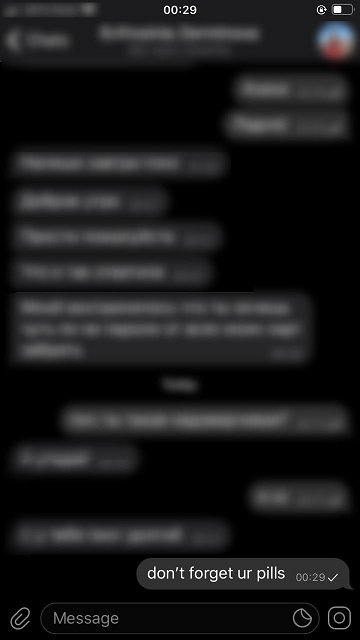

# pyCRONos
Sends messages to telegram contacts. Period is set 
using crontab syntax.

## Usage

* [Get](https://docs.telethon.dev/en/latest/basic/signing-in.html) your telegram account _api_hash_ and _api_id_ and
save them into ```secrets/api_hash``` and ```secrets/api_id``` 

* Look at your contact list and select id of subscriber
```
python pyCRONos.py --list | grep Incredulous Girl
Incredulous Girl 888888889
```
* Add this id, message and cron to ```pyCRONos.yml```
```
telegram:
  subscribers:
    888888889:  
      message: "don't forget ur pills"
      cron: '29 0 * * *'  # At 00:29 every day
```
* Run 
```
python pyCRONos.py --keepwatch
```

* Enjoy


